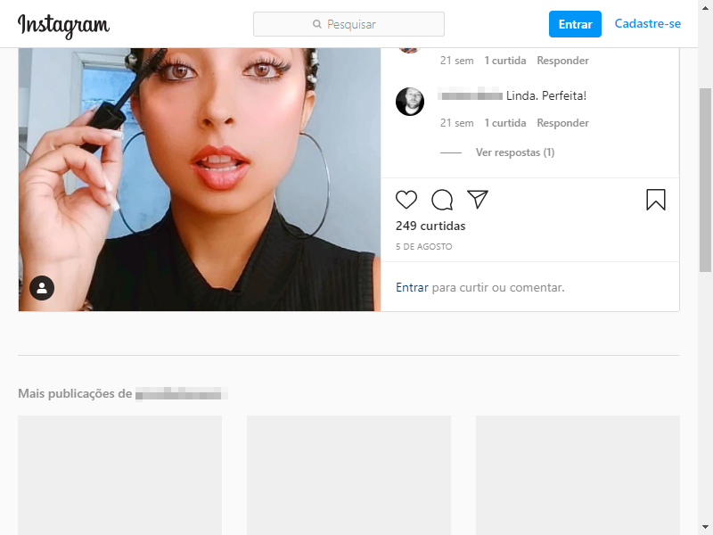

  
<center>
<h1 style="text-align: center;">INSTAGRAM-BOT-JS</h1>
===============================================================

<!---->
 

[![Contributors][contributors-shield]][contributors-url]
[![Forks][forks-shield]][forks-url]
[![Stargazers][stars-shield]][stars-url]
[![Issues][issues-shield]][issues-url]
[![MIT License][license-shield]][license-url]
[![LinkedIn][linkedin-shield]][linkedin-url]
</center>

<!-- TABLE OF CONTENTS -->
<!--
<details open="open">
  <summary>Índice</summary>
  <ol>
    <li>
      <a href="#about-the-project">About The Project</a>
      <ul>
        <li><a href="#built-with">Built With</a></li>
      </ul>
    </li>
    <li>
      <a href="#getting-started">Getting Started</a>
      <ul>
        <li><a href="#prerequisites">Prerequisites</a></li>
        <li><a href="#installation">Installation</a></li>
      </ul>
    </li>
    <li><a href="#usage">Usage</a></li>
    <li><a href="#roadmap">Roadmap</a></li>
    <li><a href="#contributing">Contributing</a></li>
    <li><a href="#license">License</a></li>
    <li><a href="#contact">Contact</a></li>
    <li><a href="#acknowledgements">Acknowledgements</a></li>
  </ol>
</details>
-->


<!-- ABOUT THE PROJECT -->
<!--
## About The Project

[![Product Name Screen Shot][product-screenshot]](https://example.com)

Existem muitos modelos README excelentes disponíveis no GitHub, no entanto, não encontrei um que realmente atendesse às minhas necessidades, então criei este aprimorado. Quero criar um modelo README tão incrível que seja o último de que você precisa - acho que é isso.

Aqui está o porquê:
* Seu tempo deve ser focado em criar algo incrível. Um projeto que resolve um problema e ajuda os outros
* Você não deve fazer as mesmas tarefas repetidamente como criar um README do zero
* Você deve incorporar os princípios DRY ao resto de sua vida :smile:

Obviamente, nenhum modelo atenderá a todos os projetos, pois suas necessidades podem ser diferentes. Portanto, estarei adicionando mais em um futuro próximo. Você também pode sugerir alterações bifurcando este repo e criando uma solicitação pull ou abrindo um problema. Obrigado a todas as pessoas que contribuíram para expandir este modelo!

Uma lista de recursos comumente usados que considero úteis está listada nos agradecimentos.

### Built With

O script de automação foi criado com javascript puro em conjunto com as tecnologias NodeJS e o módulo Puppeteer
* [NodeJs](https://getbootstrap.com)
* [Puppeter](https://jquery.com)
-->


<!-- GETTING STARTED -->
<!--
## Getting Started

Para obter uma cópia local instalada e funcionando, siga estas etapas simples do exemplo.

### Prerequisites

Para rodar satisfatoriamente o projeto, você precisará de:

* npm
  ```sh
  npm install npm@latest -g
  ```

### Installation

1. Clone the repo
    ```sh
    git clone https://github.com/gabriel7lib/instagram-bot-js.git
    ```
2. Install NPM packages
    ```sh
    npm install
    ```
3. Install Puppeteer module
    ```sh
    npm install 
    ```
4. Enter your API in `config.js`
    ```JS
    const API_KEY = 'ENTER YOUR API';
    ```
-->

<!-- USAGE EXAMPLES -->
<!--
## Usage

Use este espaço para mostrar exemplos úteis de como um projeto pode ser usado. Capturas de tela adicionais, exemplos de código e demos funcionam bem neste espaço. Você também pode acessar mais recursos.

_Para mais exemplos, consulte a [Documentatação](https://biozsec.com.br/instagram-bot-js/v1/)_
-->


<!-- ROADMAP -->
<!--
## Roadmap

Consulte os [problemas em aberto](https://github.com/othneildrew/Best-README-Template/issues) para obter uma lista de recursos propostos (e problemas conhecidos).
-->


<!-- CONTRIBUTING -->
<!-- 
## Contributing

Contributions are what make the open source community such an amazing place to be learn, inspire, and create. Any contributions you make are **greatly appreciated**.

1. Fork the Project
2. Create your Feature Branch (`git checkout -b feature/AmazingFeature`)
3. Commit your Changes (`git commit -m 'Add some AmazingFeature'`)
4. Push to the Branch (`git push origin feature/AmazingFeature`)
5. Open a Pull Request

-->

<!-- LICENSE -->
## License

Distributed under the MIT License. See `LICENSE` for more information.


<!-- CONTACT -->
## Contact

Gabriel Oliveira - [@irmaodomateus](https://instagram.com/irmadomateus) - gabriel@biozsec.com.br

Project Link: [https://github.com/gabriel7lib/instagram-bot-js](https://github.com/gabriel7lib/instagram-bot-js)


<!-- ACKNOWLEDGEMENTS -->
<!--
## Acknowledgements
* [GitHub Emoji Cheat Sheet](https://www.webpagefx.com/tools/emoji-cheat-sheet)
* [Img Shields](https://shields.io)
* [Choose an Open Source License](https://choosealicense.com)
* [GitHub Pages](https://pages.github.com)
* [Animate.css](https://daneden.github.io/animate.css)
* [Loaders.css](https://connoratherton.com/loaders)
* [Slick Carousel](https://kenwheeler.github.io/slick)
* [Smooth Scroll](https://github.com/cferdinandi/smooth-scroll)
* [Sticky Kit](http://leafo.net/sticky-kit)
* [JVectorMap](http://jvectormap.com)
* [Font Awesome](https://fontawesome.com)

-->


<!-- MARKDOWN LINKS & IMAGES -->
<!-- https://www.markdownguide.org/basic-syntax/#reference-style-links -->
[contributors-shield]: https://img.shields.io/github/contributors/gabriel7lib/instagram-bot-js.svg?style=for-the-badge
[contributors-url]: https://github.com/gabriel7lib/instagram-bot-js/graphs/contributors
[forks-shield]: https://img.shields.io/github/forks/gabriel7lib/instagram-bot-js.svg?style=for-the-badge
[forks-url]: https://github.com/gabriel7lib/instagram-bot-js/network/members
[stars-shield]: https://img.shields.io/github/stars/gabriel7lib/instagram-bot-js.svg?style=for-the-badge
[stars-url]: https://github.com/gabriel7lib/instagram-bot-js/stargazers
[issues-shield]: https://img.shields.io/github/issues/gabriel7lib/instagram-bot-js.svg?style=for-the-badge
[issues-url]: https://github.com/gabriel7lib/instagram-bot-js/issues
[license-shield]: https://img.shields.io/github/license/gabriel7lib/instagram-bot-js.svg?style=for-the-badge
[license-url]: https://github.com/gabriel7lib/instagram-bot-js/blob/master/LICENSE.txt
[linkedin-shield]: https://img.shields.io/badge/-LinkedIn-black.svg?style=for-the-badge&logo=linkedin&colorB=555
[linkedin-url]: https://www.linkedin.com/in/gabriel7ya/
[product-screenshot]: images/screenshot.png


* * *
